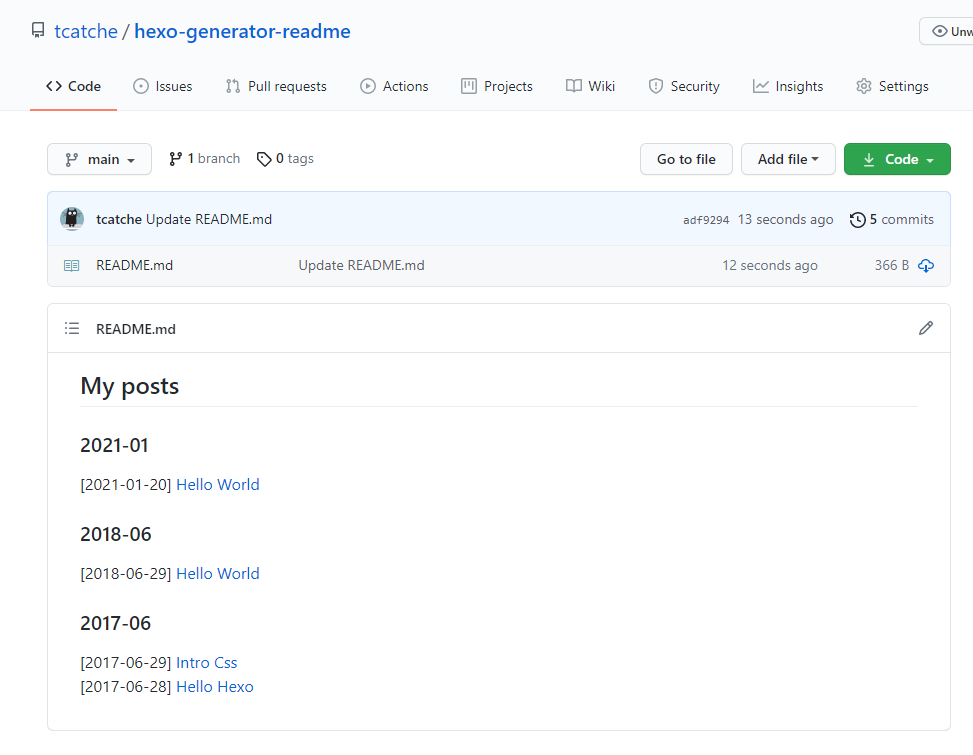

# hexo-generator-readme-file

generate a `README.md` file contains all of blog posts link.

为你的文章生成一个 `README.md` 文件，里面包含了所有的文章链接。



## install

```
npm install hexo-generator-readme-file --save
```

## Configuration

Add the following content in your configuration file (`_config.yml`):

```yml
readmeConfig:
  postsHeader: '## My posts' # headers, support markdown
  sort: 'desc' # posts display sort: 'desc' or 'acs'. The default option is 'desc'
  groupType: 'month' # 'month' or 'year' or 'none'. The default option is 'month'
```

## Related hexo plugins
- [hexo-generator-issues](https://github.com/tcatche/hexo-generator-issues): publish your hexo posts to github issues. 将个人文章发布到 github 的指定仓库下，每篇文章作为一个 issue。
- [hexo-generator-readme-file](https://github.com/tcatche/hexo-generator-readme-file): generate a `README.md` file contains all of blog posts link. 为你的文章生成一个 `README.md` 文件，里面包含了所有的文章链接。
- [hexo-filter-link-post](https://github.com/tcatche/hexo-filter-link-post): Transfer relative post link in markdown file to post link. 将文件里的通过相对路径引用的 markdown 文件转为对应的文章的链接。

## License

[MIT](./LICENSE)
